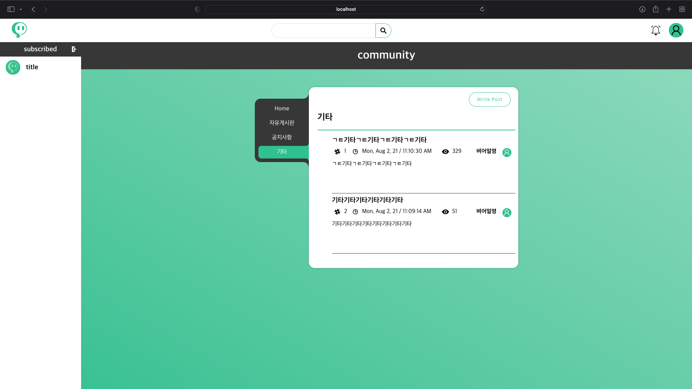

	
	<h1> Kwitch </h1>
	<h3>트위치 / 트게더를 모방한 개인 방송 플랫폼</h3>

## Tech Stacked
 - Spring
 - Mybatis
 - PostgreSQL
 - Vue.js

 

# ERD

	

 

# Screen
| <h2>main page / login</h2> |
|:---:|
|

|
|

|

 

| <h2>channel page</h2> |
|:---:|
| 

 |
| 

 |
| video |
| 

 |

 

| <h2>community</h2> |
|:---:|
| 

